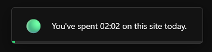
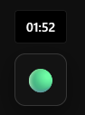
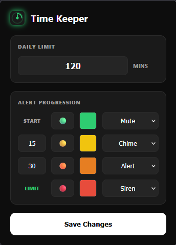

# Time Keeper

  

A browser extension that tracks how much time you spend on time-wasting websites (YouTube, Instagram, etc.) and alerts you visually and audibly.

## Features

* **Glassmorphism Interface:** A stylish, translucent widget that doesn't obstruct page content.
* **Focus Mode:** The timer only advances when you are on the active tab; background tabs do not affect the duration.
* **Customizable Thresholds:** Set time limits, icons, and colors according to your preference via the settings menu (Popup).
* **Built-in Alert Sounds:** 4 different alert tones using the Web Audio API without the need for external file loading.
* **Minimizable Design:** Click the widget to collapse it into a single icon and expand it whenever you wish.
* **Persistent Settings:** Your chosen limits and minimization preferences are stored in the browser's storage.

---

## Installation

1.  Download the project files (`manifest.json`, `content_script.js`, `popup.html`, `popup.js`, `icon.svg`) into a folder.
2.  Go to your browser's extensions page:
    * **Chrome/Edge:** `chrome://extensions/`
    * **Firefox:** `about:debugging#/runtime/this-firefox`
3.  Enable **Developer Mode**.
4.  Select **Load unpacked** and choose the folder, or select **Load temporary add-on** and point to the `manifest.json` file.

---

## Usage

* The extension automatically starts running on YouTube and Instagram.
* Access the settings menu by clicking the extension icon in the top right.
* After changing limits in the settings menu, simply click the **Save Settings** button; changes take effect immediately.

---

## File Structure

| File | Description |
| :--- | :--- |
| `manifest.json` | Extension permissions and configuration. |
| `content_script.js` | Main timer and UI code injected into the site. |
| `popup.html` & `popup.js` | Settings menu interface and logic. |
| `icon.svg` | Extension logo. |

---

## Technologies

* **Vanilla JavaScript (ES6+)**
* **Manifest V3**
* **CSS3 (Blur & Flexbox)**
* **Web Audio API**

## Screenshot

  

  

  

